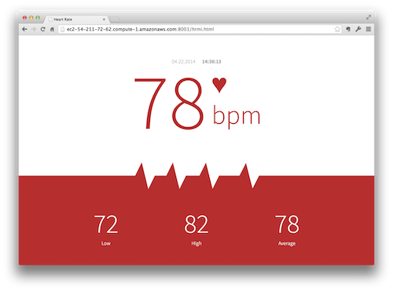
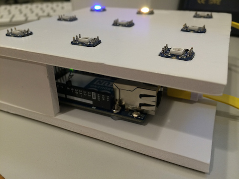

# Kaazing

Have you ever heard of the WebSocket protocol? In short, it upgrades an HTTP connection to a stateful socket. In 2014, Kaazing had been leveraging WebSocket to deliver real-time messaging to the Web. Their work was mostly focused around AMQP, but MQTT and others also showed up from time-to-time. I learned a lot of respect for publish-subscribe infrastructure while at Kaazing. I even wrote an implementation of STOMP (Simple Text-Oriented Message Protocol) for Arduino, and a basic JavaScript client for AMQP.

Kaazing was a startup. My previous employer, Adobe, was 10,000+ employees at the time. I was looking forward to the dynamic environment. Kaazing did not let me down. We produced countless demonstrations during my one year as Principal Evangelist.

> Most of the code in this repository will not even run anymore - the core products have pivoted considerably over the years. I keep it around for inspiration, and to occasionally reference patterns of problems I have solved in the past.

## Chat

Chat is the "Hello World" of real-time data - what does it look like on Kaazing Gateway?

Kaazing Gateway can run on a number of platforms.  Likewise, the Kaazing Gateway client libraries can support even more platforms.  This is an exploration of what a basic chat client looks like when using the various client libraries.  Web, Java (desktop), and Android (Java), are completed examples, and designed to interoperate with one-another.  The iOS (Swift) example has been started but is not yet complete, as the Kaazing Gateway client libraries only support Web Socket there, not AMQP publish/subscribe.

## First

What do you do for your first project when you join a company based on real-time?

In order to get my head around publish-subscribe using Kaazing Gateway, I wanted to connect to a server, send a message, and receive a message.  I did not want to manage two different screens, so this example is effectively an echo.  It sends a message to the server, which distributes it, eventually arriving back at the original screen.  The original screen in turn displays the message.  The code could be refined substantially as I learned more about publish-subscribe architectures during my employment.

## HRMI

What does your heart rate look like when you are on stage presenting?

Having presented at hundreds of events over the years, I always wondered how my body reacts to being on the stage.  I purchased an HRMI breakout some time ago, but never really put it to use.  With the growing interest in the Internet of Things (IoT), and wearable computing, I finally got around to putting the system together.  A heart rate sensor is worn, and the data is reported wireless in real time.  A browser client is provided to view the data from the audience perspective.  A flaw of wearables is that they capture the data in real time, but report it in batch.  In order to be truly useful, you need that data as it happens, and need to be alerted of critical changes.

## Internet of Things

How does one Internet all teh things?

A very broad exploration of IoT in three commercial settings - smart buildings, transportation and logistics, and retail.  The smart buildings example is based off a deployed commercial customer in the HVAC (heating, venting, air conditioning) vertical.  It allows you to see the difference real-time makes in IoT-based business decisions.  The logistics example is designed to emulate fleet tracking and mangement.  The retail example show integrating legacy equipment with modern point of sale workflows.  There is also a skeleton of basic IoT connectivity with Kaazing Gateway.  

## PetrolPal

Drive up and swipe your credit card? Go inside to pay? Or just fuel up with the real-time Web?

An extension of the POS concept, this demonstration applies Kaazing Gateway and the real-time Web to solve pay-at-the-pump systems.  Part of this solution involves a (mobile Web-based) smartphone application that allows you to find the nearest gas station.  Once you arrive at a pump, a handshake negotiates the communication channel for transaction information.  Pump away and see the amount tick by not only on the pump, but on your smartphone too.  When done, payment is just a button tap away.  Then find out the specials going on inside the store.  Secure, fast and friendly payment solutions with Kaazing Gateway and the real-time Web.

## Point of Sale

Does a cashless POS have to mean vendor lock-in, or can the real-time Web help?

Point of Sale (POS) systems are, for the most part, pretty dated.  You can visit just about any grocery store to see that.  Aside from the hardware, the software is well documented to be a security risk, with many systems running years-old operating systems.  Modern solutions to go cashless tend to be proprietary, and require additional hardware.  This example explores what a POS transaction might look like using only the Web.  Kaazing Gateway provides real-time data exchange built on advanced wire security.

## Sandbox

Kaazing Gateway went open source in December 2014!  This is a wrapper for the AMQP client.

Kaazing Gateway offers numerous means for publish/subscribe.  For the purposes of open source, AMQP 0.91 was selected.  AMQP is a robust messaging protocol, which is great for enterprise application, but not so great to get started with event driven development.  To address this learning curve, I wrote a JavaScript wrapper that exposes only the most minimalistic publish/subscribe API.  The client library uses a free "sandbox" of Gateway.  This allows developers to get started with this exciting architecture with no need to install, register, or pay for anything.

## Telemetry

Would it be possible to record data telemetry from an aircraft in real time?  

This project establishes a baseline sensor array to provide the common "six pack" of instrumentation necessary to fly an aircraft.  Also included is an an RF radio to broadcast the data over distance while in flight.  The sensor array is attached to a Phantom DJI quadcopter as an example aircraft (expensing an actual commercial aircraft was out of the question).  Data is reported wirelessly, and is recorded in multiple formats for playback at a later date.  The data is also passed along in real time to Kaazing Gateway where it is made available for interested clients (web or native).

## Tetris

Is Kaazing Gateway fast enough to use your phone as a game controller?

This is a generic port of the classic game of Tetris.  It uses the entire browser screen for falling pieces, while the game board is managed entirely via the DOM (not Canvas).  A mock controller screen is available for smartphone screens.  It is designed to be held horizontally (landscape).  Once the controller has joined the game, it can move falling pieces in real-time.  Future features that would be nice to add include multiple players, hardware controller integration, and tracking of high score across all players.

## Tic Tac Toe

Will a physical Internet of Things (IoT) light encourage real-time audience participation?

Presentations are always better when you can show real world, working examples.  This means the construction of a portable physical device that connects to cloud services and is accessible over the Internet.  Cloud services for this project showcase Kaazing Gateway deployed from AWS Marketplace onto Amazone EC2.  Run your own real-time cloud in minutes!  Hardware leveraged to build this IoT device include everyting from foam core board and glue, to an Arduino Yun communicating to the cloud via the STOMP protocol.  Audience participation is accomplished through a web-based user interface.

